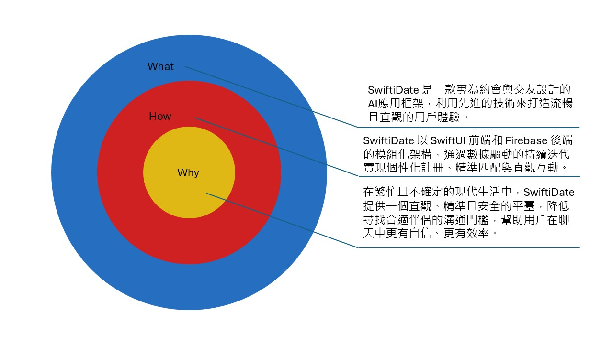
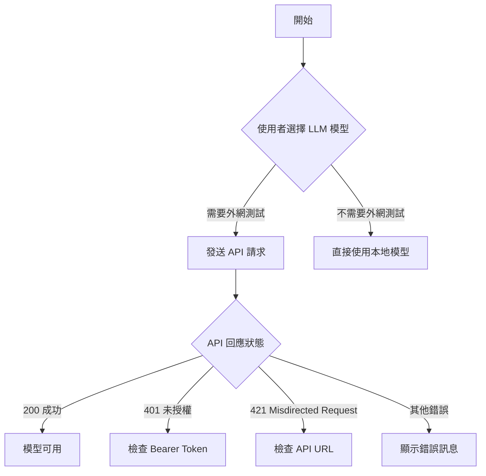

# SwiftiDate
SwiftiDate 是一款專為約會交友設計的應用程序框架，完美地利用 Swift 語言的功能和優勢來提供流暢的用戶體驗。它提供了豐富的功能，包括個性化的興趣標籤、精確的匹配算法以及直觀的用戶界面，旨在幫助用戶找到合適的約會對象。SwiftiDate 的設計理念是簡單易用，同時提供多樣的自訂選項，滿足不同用戶的需求。無論是尋找長期伴侶還是短期約會，SwiftiDate 都能為用戶提供高效且愉快的互動體驗。

---

## What / How / Why

- **What：**  
  SwiftiDate 提供專為約會與交友設計的 AI 應用框架，利用先進技術優化匹配體驗且簡單易用。

- **How：**  
  SwiftiDate 以 SwiftUI 前端和 Firebase 後端的模組化架構，並透過數據驅動的持續迭代來實現個性化興趣標籤、精準匹配與直觀互動。

- **Why：**  
  在資訊不確定的時代生活中，SwiftiDate 提供一個輕鬆、安全的平臺，降低尋找心儀對象的門檻，幫助用戶更有自信、更多效率地建立連結。

---

## 技術架構與程式結構

SwiftiDate 採用 Swift 語言，以及 Firebase 後端服務進行數據儲存、驗證和功能擴充。為了讓程式更具可維護性與可測試性，我們部分採用 [MVC](https://en.wikipedia.org/wiki/Model–view–controller)（Model-View-Controller）的設計理念：

- **Model**: 負責數據處理與商業邏輯。例如使用者資料結構、興趣標籤模型、或與 Firestore 資料庫互動的邏輯等。
- **View**: 以 SwiftUI 為基礎的 UI 元件，負責呈現使用者介面。
- **Controller / Manager**: 我們將與 Firebase 相關的初始化與設定，獨立到 `FirebaseManager`，以便集中管理並與介面邏輯分離。  
  - `FirebaseManager` 主要負責：  
    1. `FirebaseApp.configure()` 進行初始設定  
    2. Firestore、Crashlytics、App Check 等服務的啟用與設定  
    3. （未來可新增）推播或其他 Firebase 服務的集中管理  

透過這樣的拆分，我們可以：
- 更容易測試與維護 Firebase 的設定與版本更新  
- 降低視圖 (View) 與後端邏輯的耦合度  
- 讓開發者能快速定位問題所在（是 UI、業務邏輯，還是 Firebase 設定？）

未來我們也會考慮增設 `FirebaseAuthManager`、`FirebaseFunctionsManager` 等模組，以便更進一步分離各項 Firebase 服務的管理邏輯。

---

## 🎯 願景與使命

SwiftiDate 的誕生是為了讓數位時代的約會變得更簡單、更精準、更愉快。我們相信，透過高效的匹配算法、神經語言程式學（NLP）技術與個性化的用戶體驗，每個人都能輕鬆找到心儀的約會對象。

我們的目標是：
- 提供一個安全且友好的交友環境。
- 利用尖端技術（如 NLP 和人工智慧），優化匹配效率，提升用戶的溝通與互動效果。
- 設計直觀且美觀的界面，讓每次互動都充滿愉快與便捷。
- 透過 「空殼模式」，優先建立 UI 和功能框架，逐步填充內容，減少開發風險並提升市場期待感。

SwiftiDate，不僅是一個框架，更是一種致力於連接人心的創新。

---

## 📌 空殼模式（Placeholder Model）戰略

什麼是「空殼模式」？

SwiftiDate 採取 「空殼模式」 來發展產品，即：
	1.	先建立 UI 與功能框架，讓用戶能夠看到即將推出的功能。
	2.	逐步填充內容，根據用戶反饋優化和新增真正有價值的功能。
	3.	測試市場需求，透過「點擊測試」與「行為數據」判斷哪些功能值得優先開發。

這種策略已被 Apple、Tesla、Steam 遊戲業界廣泛使用，能夠：
✅ 創造市場期待感，讓用戶關注未來的更新。
✅ 降低開發風險，只開發真正受市場歡迎的功能。
✅ 增加投資人信心，展示產品未來發展方向。

---

## 敏感內容檢測：nsfw_embeddings.json 與 red_embeddings.json

在 SwiftiDate 中，我們重視用戶的互動安全與友好體驗，並致力於營造一個正向的交友環境。為此，我們在系統中整合了 **敏感內容檢測機制**，其中最關鍵的資源檔案包括：

1. **nsfw_embeddings.json**  
   - 用途：  
     - 主要用於檢測「不適宜內容 (NSFW)」，例如色情或過度暴力等。  
     - 透過 AI 模型產生的「向量嵌入 (Embeddings)」，來比對輸入內容與已知 NSFW 特徵的相似度。  
     - 比起單純關鍵字比對更彈性，可以捕捉到微妙的語意差異。
   - 更新方式：  
     - 如果需要增加或調整 NSFW 規則，可重新蒐集新的敏感內容範例並生成/訓練嵌入，更新此檔案。

2. **red_embeddings.json**  
   - 用途：  
     - 主要用於檢測「紅字警示 (Red Flags)」或可能存在 **詐騙、恐怖威脅、騷擾或其他高風險訊息** 的內容。  
     - 同樣以嵌入向量的方式呈現，讓系統在執行敏感度判斷時能做更全面的語意比對。  
   - 更新方式：  
     - 當需要擴充或優化「警示訊息」類型（如新的詐騙手法或惡意訊息）時，可更新此檔案裡的向量資料以提升偵測準確度。

### 這些檔案為何重要？
- **更精確的內容過濾**：  
  傳統關鍵字比對容易被同義字、錯別字或是隱晦用語繞過。向量嵌入則能以「語意相似度」找出更細微的違規模式。
- **保護用戶安全**：  
  SwiftiDate 作為交友平台，必須避免過度裸露、騷擾、詐騙等不當內容。這兩個檔案就是系統「防護網」的核心數據。
- **持續演進**：  
  隨著社交環境與不良訊息手法的變化，我們可以透過更新這些嵌入檔案，及時優化檢測能力。

> ⚠️ **注意**：  
> - 由於 `nsfw_embeddings.json` 與 `red_embeddings.json` 內含對應的敏感字詞或關鍵向量資訊，如果你不希望這些資料被公開，可考慮將它們放入私有儲存庫或保護分支，並在發佈前將檔案移出公開版本。  
> - 這些檔案的資料原則上不包含個人隱私資訊，但仍需注意不要在裡面留下「不適合外洩」的內部機密或測試資料。

---

## 📌 SwiftiDate 發展路線圖

### 🔹 A 輪：產品成熟與早期用戶擴展
- **目標**: 
  - 完成核心功能開發，包括個性化興趣標籤與匹配算法優化，整合 NLP 理念提升算法的用戶行為理解能力。
  - 啟動市場推廣活動，吸引 10,000 名早期用戶。
- **資金用途**: 
  - 技術團隊擴充 (工程師、設計師)。
  - 初期市場行銷與品牌建立。
- **預計時間**: [日期範圍，例如 2025 Q1-Q3]

---

### 🔹 B 輪：全球擴展與商業化
- **目標**: 
  - 開發 NLP 驅動的即時溝通優化功能，提升用戶在互動過程中的自然體驗。
  - 進一步強化匹配算法，結合 NLP 技術優化興趣標籤語意分析和匹配精度。
  - 將 SwiftiDate 推向國際市場，實現多語言支援。
  - 開發高級會員服務模式，探索營收模式（如訂閱或增值服務）。
- **資金用途**: 
  - 國際市場運營團隊。
  - 進一步強化匹配算法，融入人工智慧技術。
  - 全面行銷活動，提升品牌知名度。
- **預計時間**: [日期範圍，例如 2025 Q4-2026 Q3]

---

## 🔍 LLM 模型選擇與 API 測試流程
在 SwiftiDate 的 AI 聊天系統中，系統會根據 **使用者所在地區**、**可用 API**，以及 **模型類型** 來選擇適合的 LLM（大型語言模型）。以下是模型選擇與測試的流程：

---

### 🔹 C 輪：受控開發生態系統與市場領導地位

- **目標**: 
  - 建立 SwiftiDate 的受控開發生態系統，允許經審核的用戶在框架內開發自訂功能（如聊天 AI），但需確保 SwiftiDate 團隊對模型的技術和數據使用保持完全透明。
  - 探索多元化合作模式，例如與社交媒體或活動平台的深度整合，進一步擴大品牌影響力。
  - 成為全球約會應用框架市場的領導者，專注於高效、安全的交友互動技術。

- **資金用途**: 
  - 開發 SwiftiDate **受控開發工具包（SDK）**，提供標準化的工具和模組幫助用戶開發，但限制其僅能使用經審核的模型與數據。
  - 建立用戶開發活動的 **監管平台**，實時監控用戶所採用的技術與模型，確保合規性和安全性。
  - 開發 NLP 技術模組，應用於聊天 AI、自訂對話建議生成以及用戶情感分析，為用戶提供更自然的互動體驗。
  - 建立 NLP 技術的監管與合規平台，確保所有用戶生成內容（包括聊天 AI）符合倫理規範與隱私保護原則。
  - 加強隱私與數據安全的技術基礎，確保用戶和開發者在整個生態系統內的數據處理都符合最高標準。

---

#### 關鍵機制
1. **模型審核與註冊**：
   - 要求所有開發者報備並註冊所使用的模型（如 GPT-4、專屬 AI 模型等）。
   - 定期審查用戶模型是否符合 SwiftiDate 的倫理與隱私標準。

2. **監管工具與 API 限制**：
   - 所有開發者請求須通過 SwiftiDate 的監管層。
   - 記錄每次 API 請求的內容與用途，避免濫用。

3. **開發者合規協議**：
   - 確保所有開發者在許可範圍內開發功能。
   - 用戶需接受不定期的合規性審查。

- **預計時間**: [日期範圍，例如 2026 Q4 及以後]

---

## 🤝 支持 SwiftiDate

SwiftiDate 還在開發中（目前完成度約 75%）。若你看好這個專案的未來，並想協助我們加速開發：

你的贊助將用於：
- 資助伺服器/測試環境費用
- 聘請更多開發者協助完善 NLP 匹配功能
- 推出 Beta 版本前的市場測試

> **感謝每一位贊助者**，我們會在發佈正式版時在專案頁面公開鳴謝！

---

## 🚀 Demo

或直接點擊：
https://swiftidate-cdff0.web.app/

---

版權與授權
	•	© 2025 SwiftiDate. All rights reserved.
	•	依據貢獻者的授權，部分程式碼可能以開源授權發布，請參考專案根目錄下的 LICENSE 檔案。
