## 測試結果

我們針對 **AboutMeSection** 進行了單元測試，主要檢查以下幾點：

- 當用戶在「關於我」文字區域輸入文字時，能正確觸發 Analytics 事件，並上報文字長度。
- 透過依賴注入方式使用 MockAnalyticsManager，模擬 Analytics 行為，確保事件追蹤邏輯無誤。

所有測試均已成功通過，確保我們的 AboutMeSection 在用戶互動時能夠穩定且正確地上報分析數據。

### 測試通過截圖：
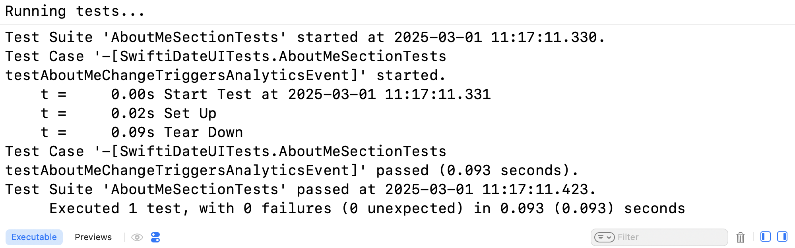

---

接著，我們針對 **BasicInfoView** 進行了 UI 互動測試，主要檢查以下幾點：

- 當用戶點擊「來自」這一基本資料列時，能正確觸發 Analytics 事件，並上報 "tap_edit_hometown" 事件。
- 點擊後能正確設置顯示 hometown 輸入頁面的標誌，確保用戶能夠進行資料更新。

所有測試均已成功通過，確保我們的 BasicInfoView 在用戶互動時能夠正確響應並記錄使用者行為。

### 測試通過截圖：
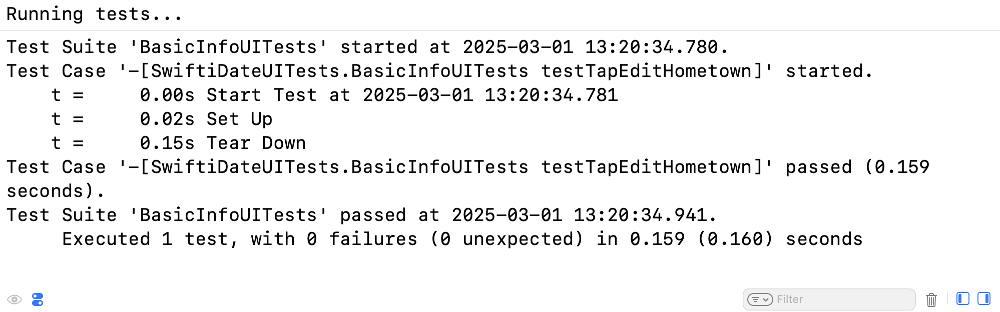

---

### DegreePicker 測試結果
我們針對 **DegreePicker** 進行了 UI 互動測試，主要檢查以下幾點：

- 當用戶點擊某個學歷按鈕（例如「學士」）時，對應的綁定值會正確更新為該選項。
- 當用戶點擊「取消」按鈕時，學歷選擇會被清空（變為 nil）。

所有測試均已成功通過，確保 DegreePicker 能夠正確響應用戶操作並更新綁定狀態。

### 測試通過截圖：
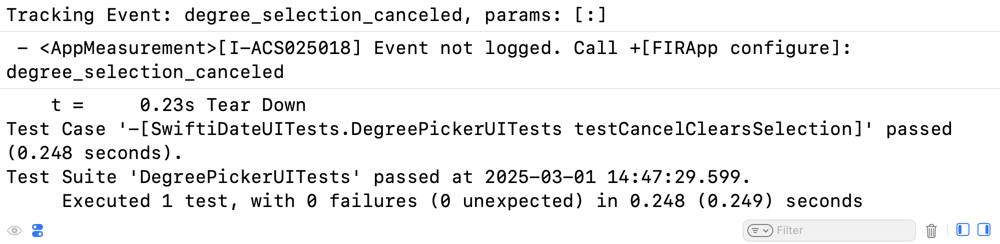

---

### DietPreferencesView 測試結果
我們針對 DietPreferencesView 進行了 UI 互動測試，主要檢查以下幾點：

- 當用戶點擊某個飲食偏好按鈕時，能正確更新綁定值，並透過 Analytics 上報對應的 "diet_preference_selected" 事件。
- 點擊「清空」按鈕後，能正確清空綁定值，並觸發 "diet_preference_cleared" 事件。
- 當用戶在選擇完偏好後點擊「確定」按鈕時，能正確上報 "diet_preference_confirmed" 事件，並傳入當前選擇的偏好值。

所有測試均已成功通過，確保我們的 DietPreferencesView 能夠正確響應用戶操作並上報分析數據。

### 測試通過截圖：
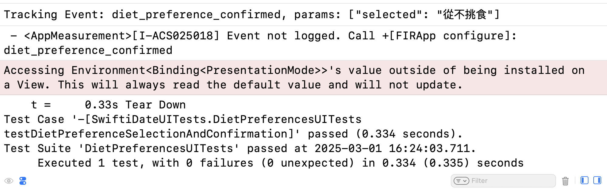

---

### DrinkOptionsView 測試結果

我們針對 DrinkOptionsView 進行了 UI 互動測試，主要檢查以下幾點：

- 當用戶點擊某個飲酒選項按鈕（例如「只在社交場合」）時，能正確更新綁定值，並透過 Analytics 上報對應的 “drink_option_selected” 事件。
- 點擊「清空」按鈕後，能正確清空綁定值，並觸發 “drink_option_cleared” 事件。
- 當用戶在選擇完飲酒選項後點擊「確定」按鈕時，能正確上報 “drink_option_confirmed” 事件，並傳入當前選擇的選項值。

所有測試均已成功通過，確保我們的 DrinkOptionsView 能夠正確響應用戶操作並上報分析數據。

### 測試通過截圖：
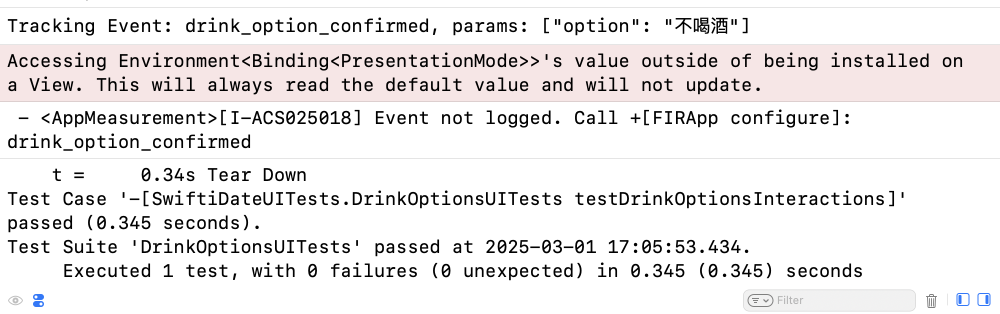

---

### EducationAndWorkView 測試結果

我們針對 EducationAndWorkView 進行了 UI 互動測試，主要檢查以下幾點：

- 當用戶點擊「學歷」、「學校」、「工作行業」或「職業」這些 row 時，能正確觸發相應的 Analytics 事件 (例如 "education_row_tapped") 並附帶對應的參數（如 "degree"、"school" 等）。
- 點擊後能正確設置顯示相應輸入頁面或選擇器的布林標誌（如 showDegreePicker、showSchoolInput、showIndustryPicker、showJobInput），確保用戶能夠進行資料更新。
- 當整個視圖出現時，能正確觸發 "education_and_work_view_appear" 事件。

所有測試均已成功通過，確保我們的 EducationAndWorkView 在用戶互動時能夠正確響應並上報分析數據。

### 測試通過截圖：
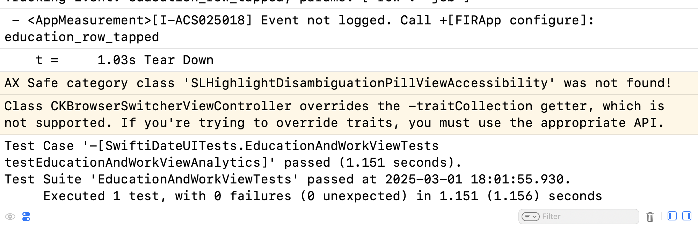

---

### FitnessOptionsView 測試結果

我們針對 FitnessOptionsView 進行了 UI 互動測試，主要檢查以下幾點：

- 當畫面出現時，能正確觸發 "fitness_options_view_appear" 事件。
- 當用戶點擊「經常健身」按鈕時，對應的 binding 更新為 "經常健身"，並透過 Analytics 上報 "fitness_option_selected" 事件。
- 當用戶點擊「清空」按鈕後，binding 被清空，並觸發 "fitness_option_cleared" 事件。
- 當用戶點擊「有時候」按鈕後，binding 更新為 "有時候"；接著點擊「確定」按鈕時，能正確上報 "fitness_option_confirmed" 事件，並傳入當前所選選項。

所有測試均已成功通過，確保 FitnessOptionsView 在用戶互動時能夠正確響應並上報分析數據。

### 測試通過截圖：
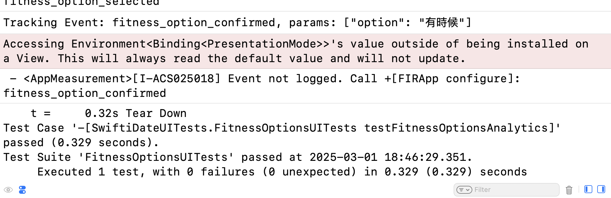

---

### HeightPickerView 測試結果

我們針對 HeightPickerView 進行了 UI 互動測試，主要檢查以下幾點：

- 當用戶透過 picker 選擇身高（例如選擇 180 cm）時，對應的 binding 能夠正確更新為所選身高。
- 當用戶點擊「確定」按鈕時，會觸發 Analytics 上報事件 "update_height"，並傳入正確的身高參數（例如 180）。
- 當用戶點擊「清空」按鈕時，能正確清空 binding（即設定為 nil）。

所有測試均已成功通過，確保 HeightPickerView 在用戶互動時能夠正確更新綁定值並上報分析數據。

### 測試通過截圖
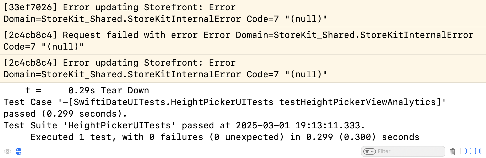

---

### HometownInputView 測試結果

我們針對 HometownInputView 進行了 UI 互動測試，主要檢查以下幾點：

- 當畫面出現時，上報 "hometown_input_view_appear" 事件。
- 當用戶在輸入框中輸入家鄉資料（例如輸入 "Taipei"）時，對應的 binding 能夠正確更新。
- 當用戶點擊「確定」按鈕時，上報 "hometown_confirmed" 事件，並傳入正確的家鄉資料（如 "Taipei"）。
- 當用戶點擊「清空」按鈕時，binding 被清空（設為 nil），並上報 "hometown_cleared" 事件。

所有測試均已成功通過，確保 HometownInputView 在用戶互動時能夠正確更新資料並上報分析數據。

### 測試通過截圖：
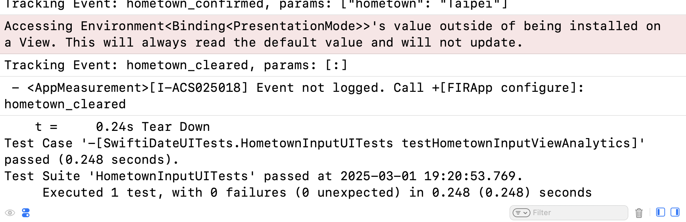

---

### IndustryPicker 測試結果

我們針對 IndustryPicker 進行了 UI 互動測試，主要檢查以下幾點：

- 當畫面出現時，能正確觸發頁面曝光事件 "industry_picker_view_appear"。
- 當用戶點擊某個行業按鈕（例如「醫療」）時，對應的 binding 能夠正確更新為該行業，同時透過 Analytics 上報 "industry_selected" 事件，並傳入正確的行業參數（例如 "醫療"）。
- 當用戶點擊「清空」按鈕時，binding 被清空（設為 nil），並上報 "industry_cleared" 事件。

所有測試均已成功通過，確保我們的 IndustryPicker 在用戶互動時能夠正確更新資料並上報分析數據。

### 測試通過截圖：
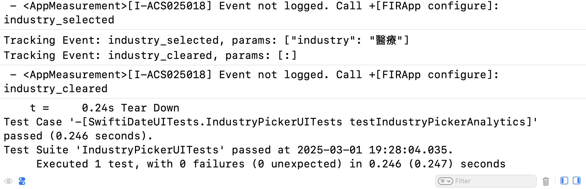

---

### InterestsView UITests 測試結果

我們針對 InterestsView 進行了 UI 互動測試，主要檢查以下幾點：

- 當畫面出現時，上報 "interests_view_appear" 事件，記錄使用者進入 InterestsView 的時間。
- 當用戶點擊興趣區（透過設定了 accessibilityIdentifier 的容器）時，能正確觸發 onTapGesture，從而更新內部狀態並上報 "interest_selection_sheet_opened" 事件。
- 當狀態更新後，能夠正確呈現 sheet，並顯示 InterestSelectionView 的內容，確保用戶能夠進一步進行興趣選擇。

所有測試均已成功通過，確保 InterestsView 在用戶互動時能夠正確響應並上報分析數據。

### 測試通過截圖：
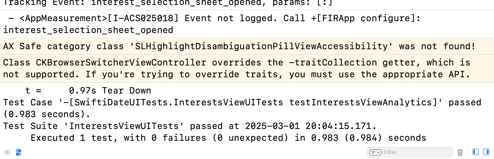

---

### InterestSelectionView 測試結果

我們針對 InterestSelectionView 進行了 UI 互動測試，主要檢查以下幾點：

- 當畫面出現時，上報 "interest_selection_view_appear" 事件，確保用戶進入該頁面時能夠進行統計。
- 當用戶點擊某個興趣標籤（例如「閱讀」）時，對應的 binding 能夠正確更新，並在後台透過 Analytics 上報選中該標籤事件，同時記錄該興趣的顏色資訊。
- 測試模擬了用戶多次點擊不同標籤的行為，確保選中和取消選中的邏輯均能正確運作，且資料能正確儲存在 binding 中。

所有測試均已成功通過，確保 InterestSelectionView 在用戶互動時能夠正確更新狀態並上報相關 Analytics 數據。

### 測試通過截圖：
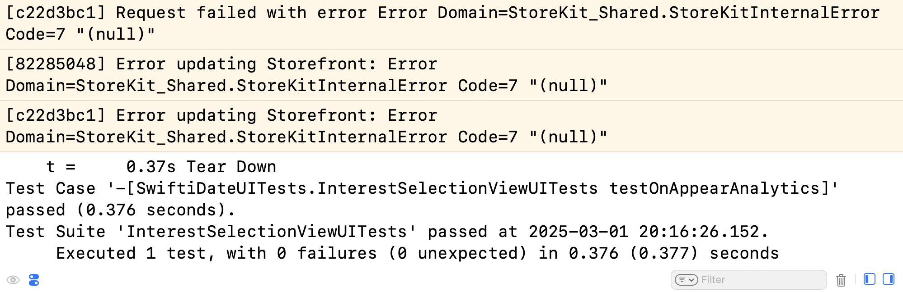

---

### JobInputView 測試結果

我們針對 JobInputView 進行了 UI 互動測試，主要檢查以下幾點：

- 當畫面出現時，上報 "job_input_view_appear" 事件，確保用戶進入 JobInputView 時進行頁面曝光統計。
- 當用戶在輸入框中輸入職業資訊（例如輸入 "軟體工程師"）時，對應的 binding 能夠正確更新。
- 當用戶點擊「清空」按鈕時，binding 被清空（變為 nil），同時上報 "job_input_cleared" 事件。
- 當用戶點擊「確定」按鈕時，會上報 "job_input_confirmed" 事件，並傳入正確的職業資訊（如 "軟體工程師"）。

所有測試均已成功通過，確保 JobInputView 在用戶互動時能夠正確更新資料並上報分析數據。

### 測試通過截圖：
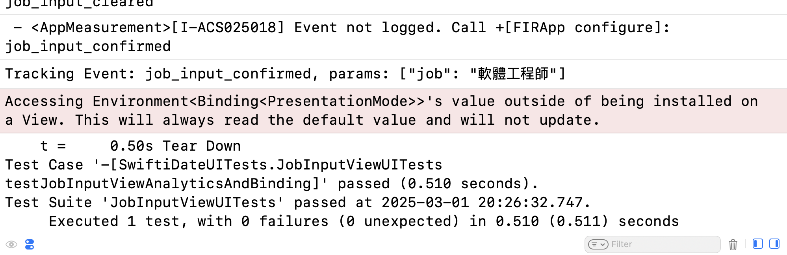

---

### LanguageSelectionView 測試結果

我們針對 LanguageSelectionView 進行了 UI 互動測試，主要檢查以下幾點：

- 當畫面出現時，應正確呈現所有可選語言，並在背景執行中不影響使用體驗。
- 當用戶點擊某個語言（例如「English」）時，對應的 binding 能夠正確更新，並透過 Analytics 上報 “language_selected” 事件，附帶正確的語言參數。
- 當用戶再次點擊已選中的語言時，該語言會被取消選中，並上報 “language_deselected” 事件。
- 當用戶同時選中多個語言（例如 “中文”、“日本語”），binding 能夠正確記錄所有選項，且各自的選中事件均已上報。
- 當用戶點擊「清空」按鈕後，所有語言選擇均被清空，並上報 “languages_cleared” 事件。
- 當用戶點擊「確定」按鈕後，會上報 “languages_confirmed” 事件，並傳入選中語言的總數。

所有測試均已成功通過，確保 LanguageSelectionView 在用戶互動時能夠正確更新綁定狀態並上報相關的 Analytics 數據。

### 測試通過截圖：
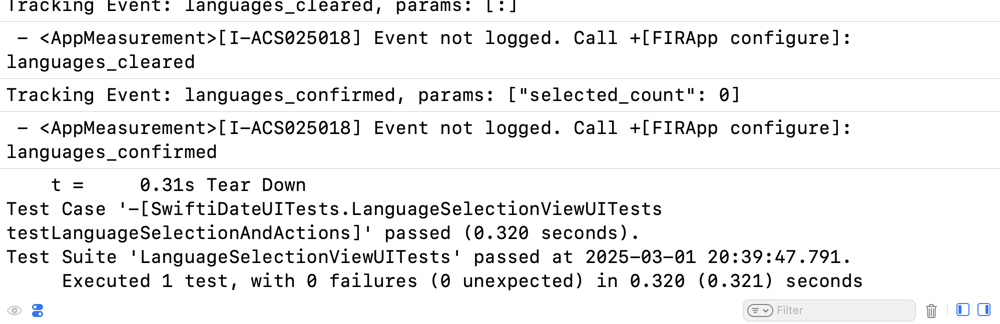
