## 測試結果

我們針對 **AboutMeSection** 進行了單元測試，主要檢查以下幾點：

- 當用戶在「關於我」文字區域輸入文字時，能正確觸發 Analytics 事件，並上報文字長度。
- 透過依賴注入方式使用 MockAnalyticsManager，模擬 Analytics 行為，確保事件追蹤邏輯無誤。

所有測試均已成功通過，確保我們的 AboutMeSection 在用戶互動時能夠穩定且正確地上報分析數據。

### 測試通過截圖：
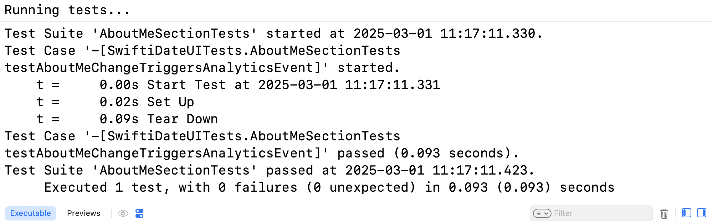

---

接著，我們針對 **BasicInfoView** 進行了 UI 互動測試，主要檢查以下幾點：

- 當用戶點擊「來自」這一基本資料列時，能正確觸發 Analytics 事件，並上報 "tap_edit_hometown" 事件。
- 點擊後能正確設置顯示 hometown 輸入頁面的標誌，確保用戶能夠進行資料更新。

所有測試均已成功通過，確保我們的 BasicInfoView 在用戶互動時能夠正確響應並記錄使用者行為。

### 測試通過截圖：

---

### DegreePicker 測試結果
我們針對 **DegreePicker** 進行了 UI 互動測試，主要檢查以下幾點：

- 當用戶點擊某個學歷按鈕（例如「學士」）時，對應的綁定值會正確更新為該選項。
- 當用戶點擊「取消」按鈕時，學歷選擇會被清空（變為 nil）。

所有測試均已成功通過，確保 DegreePicker 能夠正確響應用戶操作並更新綁定狀態。

### 測試通過截圖：

---

### DietPreferencesView 測試結果
我們針對 DietPreferencesView 進行了 UI 互動測試，主要檢查以下幾點：

- 當用戶點擊某個飲食偏好按鈕時，能正確更新綁定值，並透過 Analytics 上報對應的 "diet_preference_selected" 事件。
- 點擊「清空」按鈕後，能正確清空綁定值，並觸發 "diet_preference_cleared" 事件。
- 當用戶在選擇完偏好後點擊「確定」按鈕時，能正確上報 "diet_preference_confirmed" 事件，並傳入當前選擇的偏好值。

所有測試均已成功通過，確保我們的 DietPreferencesView 能夠正確響應用戶操作並上報分析數據。

### 測試通過截圖：
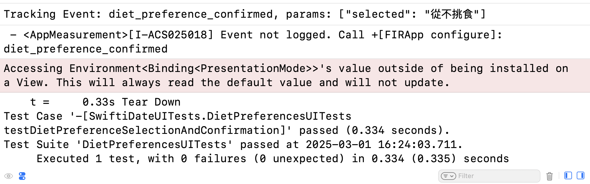

---

### DrinkOptionsView 測試結果

我們針對 DrinkOptionsView 進行了 UI 互動測試，主要檢查以下幾點：

- 當用戶點擊某個飲酒選項按鈕（例如「只在社交場合」）時，能正確更新綁定值，並透過 Analytics 上報對應的 “drink_option_selected” 事件。
- 點擊「清空」按鈕後，能正確清空綁定值，並觸發 “drink_option_cleared” 事件。
- 當用戶在選擇完飲酒選項後點擊「確定」按鈕時，能正確上報 “drink_option_confirmed” 事件，並傳入當前選擇的選項值。

所有測試均已成功通過，確保我們的 DrinkOptionsView 能夠正確響應用戶操作並上報分析數據。

### 測試通過截圖：

---

### EducationAndWorkView 測試結果

我們針對 EducationAndWorkView 進行了 UI 互動測試，主要檢查以下幾點：

- 當用戶點擊「學歷」、「學校」、「工作行業」或「職業」這些 row 時，能正確觸發相應的 Analytics 事件 (例如 "education_row_tapped") 並附帶對應的參數（如 "degree"、"school" 等）。
- 點擊後能正確設置顯示相應輸入頁面或選擇器的布林標誌（如 showDegreePicker、showSchoolInput、showIndustryPicker、showJobInput），確保用戶能夠進行資料更新。
- 當整個視圖出現時，能正確觸發 "education_and_work_view_appear" 事件。

所有測試均已成功通過，確保我們的 EducationAndWorkView 在用戶互動時能夠正確響應並上報分析數據。

### 測試通過截圖：
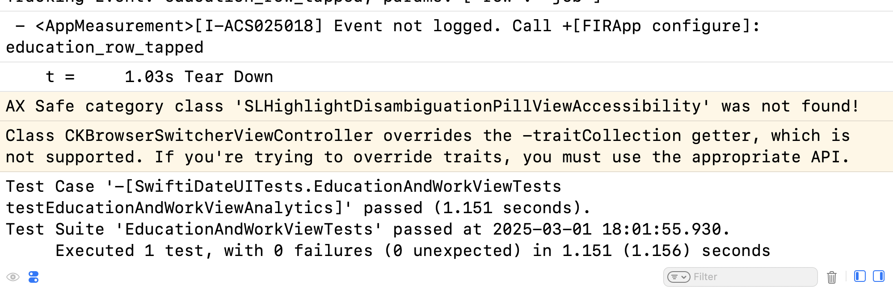

---

### FitnessOptionsView 測試結果

我們針對 FitnessOptionsView 進行了 UI 互動測試，主要檢查以下幾點：

- 當畫面出現時，能正確觸發 "fitness_options_view_appear" 事件。
- 當用戶點擊「經常健身」按鈕時，對應的 binding 更新為 "經常健身"，並透過 Analytics 上報 "fitness_option_selected" 事件。
- 當用戶點擊「清空」按鈕後，binding 被清空，並觸發 "fitness_option_cleared" 事件。
- 當用戶點擊「有時候」按鈕後，binding 更新為 "有時候"；接著點擊「確定」按鈕時，能正確上報 "fitness_option_confirmed" 事件，並傳入當前所選選項。

所有測試均已成功通過，確保 FitnessOptionsView 在用戶互動時能夠正確響應並上報分析數據。

### 測試通過截圖：
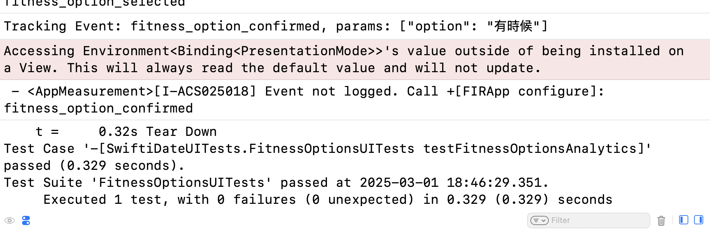

---

### HeightPickerView 測試結果

我們針對 HeightPickerView 進行了 UI 互動測試，主要檢查以下幾點：

- 當用戶透過 picker 選擇身高（例如選擇 180 cm）時，對應的 binding 能夠正確更新為所選身高。
- 當用戶點擊「確定」按鈕時，會觸發 Analytics 上報事件 "update_height"，並傳入正確的身高參數（例如 180）。
- 當用戶點擊「清空」按鈕時，能正確清空 binding（即設定為 nil）。

所有測試均已成功通過，確保 HeightPickerView 在用戶互動時能夠正確更新綁定值並上報分析數據。

### 測試通過截圖
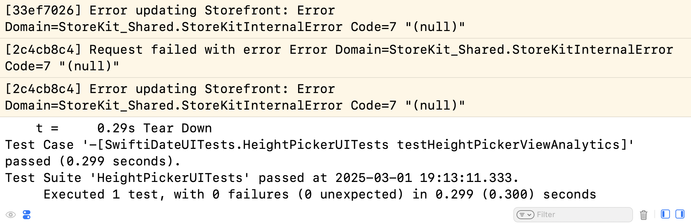

---

### HometownInputView 測試結果

我們針對 HometownInputView 進行了 UI 互動測試，主要檢查以下幾點：

- 當畫面出現時，上報 "hometown_input_view_appear" 事件。
- 當用戶在輸入框中輸入家鄉資料（例如輸入 "Taipei"）時，對應的 binding 能夠正確更新。
- 當用戶點擊「確定」按鈕時，上報 "hometown_confirmed" 事件，並傳入正確的家鄉資料（如 "Taipei"）。
- 當用戶點擊「清空」按鈕時，binding 被清空（設為 nil），並上報 "hometown_cleared" 事件。

所有測試均已成功通過，確保 HometownInputView 在用戶互動時能夠正確更新資料並上報分析數據。

### 測試通過截圖：
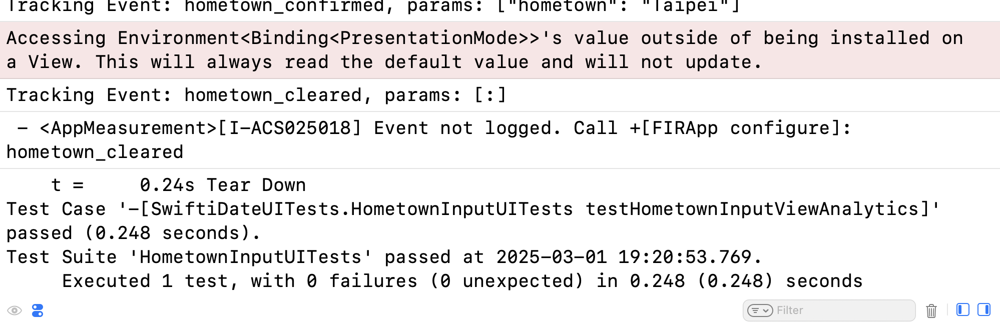

---

### IndustryPicker 測試結果

我們針對 IndustryPicker 進行了 UI 互動測試，主要檢查以下幾點：

- 當畫面出現時，能正確觸發頁面曝光事件 "industry_picker_view_appear"。
- 當用戶點擊某個行業按鈕（例如「醫療」）時，對應的 binding 能夠正確更新為該行業，同時透過 Analytics 上報 "industry_selected" 事件，並傳入正確的行業參數（例如 "醫療"）。
- 當用戶點擊「清空」按鈕時，binding 被清空（設為 nil），並上報 "industry_cleared" 事件。

所有測試均已成功通過，確保我們的 IndustryPicker 在用戶互動時能夠正確更新資料並上報分析數據。

### 測試通過截圖：
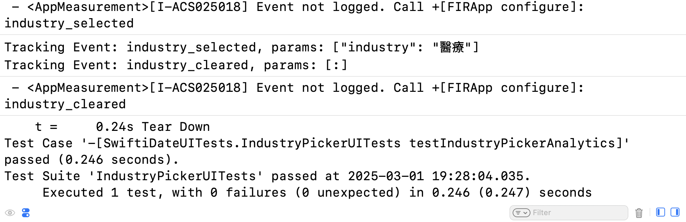

---

### InterestsView UITests 測試結果

我們針對 InterestsView 進行了 UI 互動測試，主要檢查以下幾點：

- 當畫面出現時，上報 "interests_view_appear" 事件，記錄使用者進入 InterestsView 的時間。
- 當用戶點擊興趣區（透過設定了 accessibilityIdentifier 的容器）時，能正確觸發 onTapGesture，從而更新內部狀態並上報 "interest_selection_sheet_opened" 事件。
- 當狀態更新後，能夠正確呈現 sheet，並顯示 InterestSelectionView 的內容，確保用戶能夠進一步進行興趣選擇。

所有測試均已成功通過，確保 InterestsView 在用戶互動時能夠正確響應並上報分析數據。

### 測試通過截圖：
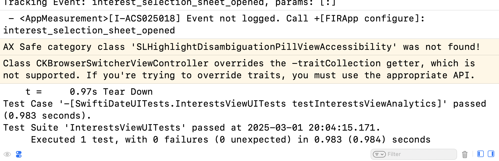

---

### InterestSelectionView 測試結果

我們針對 InterestSelectionView 進行了 UI 互動測試，主要檢查以下幾點：

- 當畫面出現時，上報 "interest_selection_view_appear" 事件，確保用戶進入該頁面時能夠進行統計。
- 當用戶點擊某個興趣標籤（例如「閱讀」）時，對應的 binding 能夠正確更新，並在後台透過 Analytics 上報選中該標籤事件，同時記錄該興趣的顏色資訊。
- 測試模擬了用戶多次點擊不同標籤的行為，確保選中和取消選中的邏輯均能正確運作，且資料能正確儲存在 binding 中。

所有測試均已成功通過，確保 InterestSelectionView 在用戶互動時能夠正確更新狀態並上報相關 Analytics 數據。

### 測試通過截圖：

---

### JobInputView 測試結果

我們針對 JobInputView 進行了 UI 互動測試，主要檢查以下幾點：

- 當畫面出現時，上報 "job_input_view_appear" 事件，確保用戶進入 JobInputView 時進行頁面曝光統計。
- 當用戶在輸入框中輸入職業資訊（例如輸入 "軟體工程師"）時，對應的 binding 能夠正確更新。
- 當用戶點擊「清空」按鈕時，binding 被清空（變為 nil），同時上報 "job_input_cleared" 事件。
- 當用戶點擊「確定」按鈕時，會上報 "job_input_confirmed" 事件，並傳入正確的職業資訊（如 "軟體工程師"）。

所有測試均已成功通過，確保 JobInputView 在用戶互動時能夠正確更新資料並上報分析數據。

### 測試通過截圖：
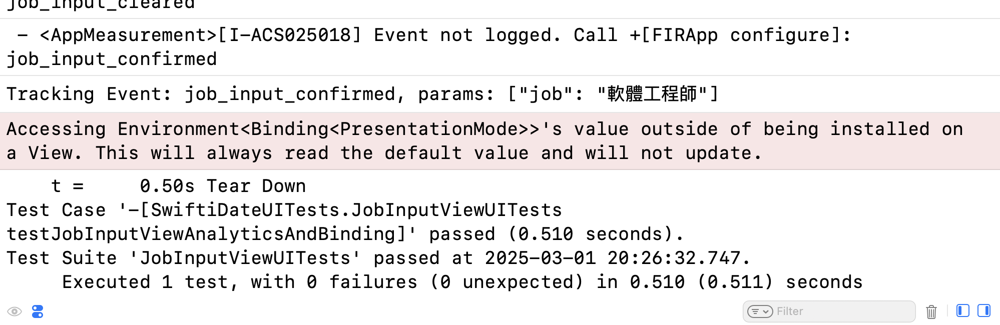

---

### LanguageSelectionView 測試結果

我們針對 LanguageSelectionView 進行了 UI 互動測試，主要檢查以下幾點：

- 當畫面出現時，應正確呈現所有可選語言，並在背景執行中不影響使用體驗。
- 當用戶點擊某個語言（例如「English」）時，對應的 binding 能夠正確更新，並透過 Analytics 上報 “language_selected” 事件，附帶正確的語言參數。
- 當用戶再次點擊已選中的語言時，該語言會被取消選中，並上報 “language_deselected” 事件。
- 當用戶同時選中多個語言（例如 “中文”、“日本語”），binding 能夠正確記錄所有選項，且各自的選中事件均已上報。
- 當用戶點擊「清空」按鈕後，所有語言選擇均被清空，並上報 “languages_cleared” 事件。
- 當用戶點擊「確定」按鈕後，會上報 “languages_confirmed” 事件，並傳入選中語言的總數。

所有測試均已成功通過，確保 LanguageSelectionView 在用戶互動時能夠正確更新綁定狀態並上報相關的 Analytics 數據。

### 測試通過截圖：
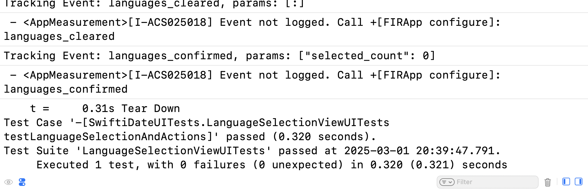

---

### LifeStyleView 測試結果

我們針對 LifeStyleView 進行了 UI 互動測試，主要檢查以下幾點：

- 當畫面出現時，上報 "lifestyle_view_appear" 事件，確保用戶進入 LifeStyleView 時能夠正確記錄頁面曝光。
- 當用戶點擊各個 LifestyleRowView 時，能夠正確觸發對應的 Analytics 事件，例如：
    - 點擊「想找」行上報 "lifestyle_lookingfor_tapped" 事件。
    - 點擊「寵物」行上報 "lifestyle_pet_tapped" 事件。
    - 點擊「健身」行上報 "lifestyle_fitness_tapped" 事件。
    - 點擊「抽煙」行上報 "lifestyle_smoking_tapped" 事件。
    - 點擊「喝酒」行上報 "lifestyle_drink_tapped" 事件。
    - 點擊「休假日」行上報 "lifestyle_vacation_tapped" 事件。
    - 點擊「飲食習慣」行上報 "lifestyle_diet_tapped" 事件。
    - 每一行的點擊操作均觸發了相應的狀態更新（例如，通過 sheet 呈現相關的選擇頁面）。

所有測試均已成功通過，確保 LifeStyleView 在用戶互動時能夠正確響應操作並上報分析數據。

### 測試通過截圖：
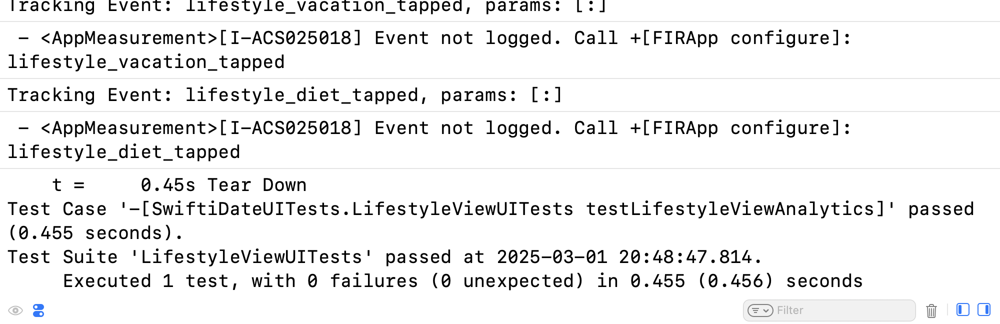

---

### LookingForView 測試結果

我們針對 LookingForView 進行了 UI 互動測試，主要檢查以下幾點：

- 當畫面出現時，上報 "lookingfor_view_appear" 事件，確保頁面曝光統計正確。
- 當用戶點擊某個尋找選項（例如「終身伴侶」）時，對應的 binding 能夠正確更新，並透過 Analytics 上報 "lookingfor_option_selected" 事件，附帶正確的選項參數。
- 當用戶點擊「清空」按鈕時，所有尋找選項均被清空，並上報 "lookingfor_cleared" 事件。
- 當用戶點擊「確定」按鈕時，會上報 "lookingfor_confirmed" 事件，並傳入當前選擇的選項值（例如 "穩定的關係"）。

所有測試均已成功通過，確保 LookingForView 在用戶互動時能夠正確更新資料並上報相關的 Analytics 數據。

### 測試通過截圖：
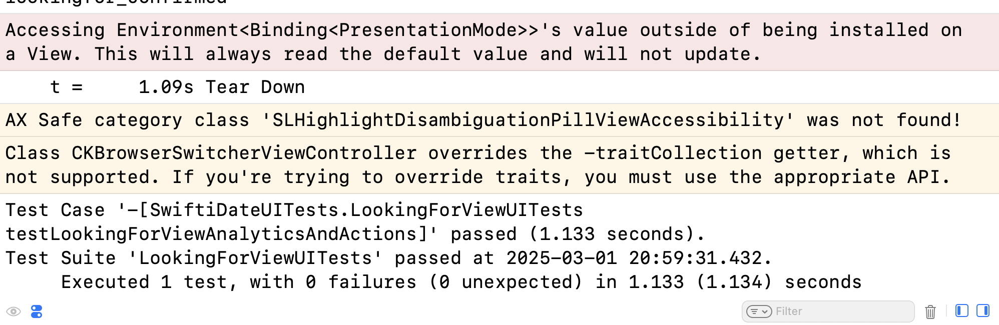

---

### MeetWillingnessView 測試結果

我們針對 MeetWillingnessView 進行了 UI 互動測試，主要檢查以下幾點：

- 當畫面出現時，上報 "meet_willingness_view_appear" 事件，確保用戶進入該頁面時能夠正確統計頁面曝光。
- 當用戶點擊見面意願選項（例如「期待立刻見面」）時，對應的 binding 能夠正確更新，並透過 Analytics 上報 "meet_option_selected" 事件，附帶正確的選項參數。
- 當用戶點擊「清空」按鈕時，會清空所選意願並上報 "meet_willingness_cleared" 事件。
- 當用戶點擊返回 (xmark) 按鈕時，會更新綁定使頁面關閉，並上報 "meet_willingness_view_dismissed" 事件。

所有測試均已成功通過，確保 MeetWillingnessView 在用戶互動時能夠正確更新狀態並上報相關 Analytics 數據。

### 測試通過截圖：
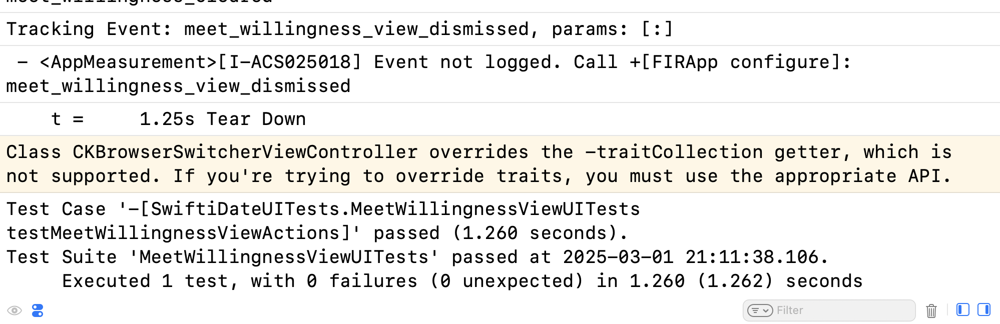

---

### PetSelectionView 測試結果

我們針對 PetSelectionView 進行了 UI 互動測試，主要檢查以下幾點：

- 當畫面出現時，上報 "pet_selection_view_appear" 事件，確保頁面曝光統計正確。
- 當用戶點擊某個寵物選項（例如「養貓」）時，對應的 binding 能夠正確更新，並透過 Analytics 上報 "pet_option_selected" 事件，附帶正確的選項參數。
- 當用戶點擊「清空」按鈕後，所有寵物選擇均被清空（binding 設為 nil），並上報 "pet_selection_cleared" 事件。
- 當用戶點擊「確定」按鈕時，會上報 "pet_selection_confirmed" 事件，並傳入當前所選寵物資訊（若無選擇則傳入 “none”）。

所有測試均已成功通過，確保 PetSelectionView 在用戶互動時能夠正確更新資料並上報相關的 Analytics 數據。

### 測試通過截圖：
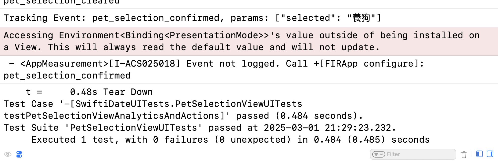

---

### PreviewSectionView 測試結果

我們針對 PreviewSectionView 進行了 UI 互動測試，主要檢查以下幾點：

- 當畫面出現時，上報 “preview_section_view_appear” 事件，並傳入正確的照片數量參數。
- 用戶透過左右點擊區域切換照片時，能夠正確更新當前顯示照片的索引，並上報相應的 “preview_section_photo_next” 或 “preview_section_photo_previous” 事件。
- 當用戶點擊左右點擊區域時，能夠正確觸發切換動作，確保介面正確反映當前選中的照片。

所有測試均已成功通過，確保 PreviewSectionView 在用戶互動時能夠正確更新顯示並上報分析數據。

### 測試通過截圖：
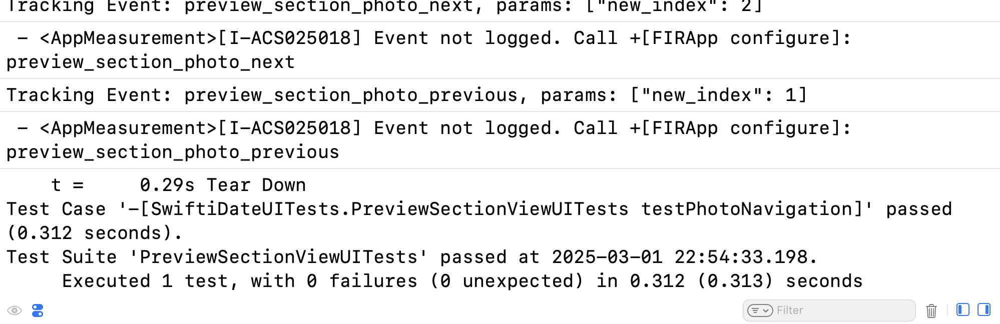

---

### SchoolInputView 測試結果

我們針對 SchoolInputView 進行了 UI 互動測試，主要檢查以下幾點：

- 頁面曝光：當畫面出現時，上報 "school_input_view_appear" 事件，確保頁面曝光統計正確。
- 輸入操作：當用戶在輸入框中輸入學校名稱（例如輸入 "Test School"）時，對應的綁定值能夠正確更新，並驗證該值已同步至綁定變數。
- 確認操作：當用戶點擊「確定」按鈕時，上報 "school_input_confirmed" 事件，並傳入正確的學校名稱（例如 "Test School"）。
- 清空操作：當用戶點擊「清空」按鈕時，綁定值被清空（變為 nil），同時上報 "school_input_cleared" 事件。

所有測試均已成功通過，確保 SchoolInputView 在用戶互動時能夠正確更新資料並上報相應的 Analytics 數據。

### 測試通過截圖：
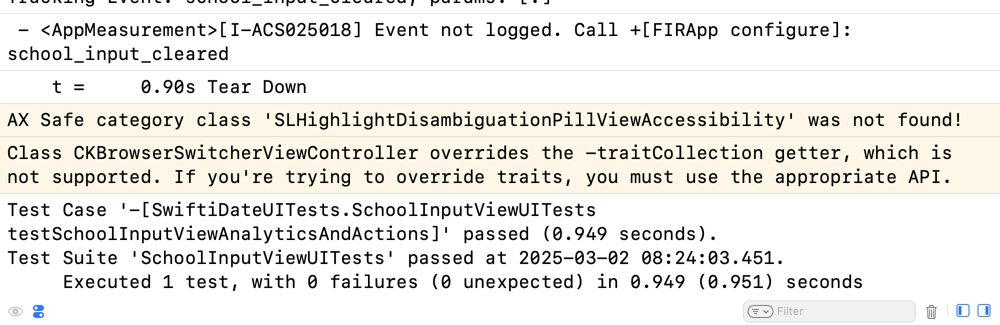

---

### SmokingOptionsView 測試結果

我們針對 SmokingOptionsView 進行了 UI 互動測試，主要檢查以下幾點：

- 當畫面出現時，用戶能看到所有抽煙選項按鈕。
- 當用戶點擊某個抽煙選項（例如「不抽煙」）時，對應的綁定值會正確更新，同時透過 Analytics 上報 “smoking_option_selected” 事件，並附帶正確的選項參數。
- 當用戶點擊「清空」按鈕後，抽煙選項會被清空（綁定值變為 nil），並上報 “smoking_option_cleared” 事件。
- 當用戶點擊「確定」按鈕時，會上報 “smoking_option_confirmed” 事件，並傳入當前所選的抽煙選項（若無選擇則傳入 “none”）。

所有測試均已成功通過，確保 SmokingOptionsView 在用戶互動時能夠正確更新狀態並上報相關 Analytics 數據。

### 測試通過截圖：
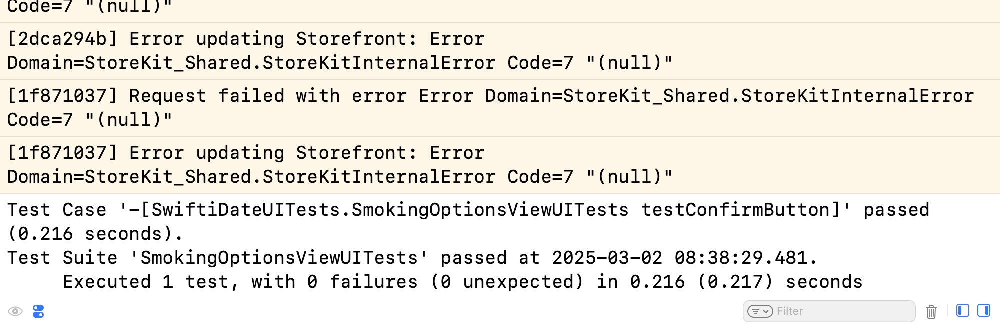

---

### VacationOptionsView 測試結果

我們針對 VacationOptionsView 進行了 UI 互動測試，主要檢查以下幾點：

- **頁面曝光**：當畫面出現時，上報 “vacation_options_view_appear” 事件，確保頁面曝光統計正確。
- **選項點擊**：當用戶點擊某個休假選項（例如「週末休息」）時，綁定值能夠正確更新為該選項，同時透過 Analytics 上報「vacation_option_selected」事件，並附帶該選項參數。
- **清空操作**：當用戶點擊「清空」按鈕後，所有休假選項均被清空（綁定值設為 nil），並上報「vacation_option_cleared」事件。
- **確認操作**：當用戶點擊「確定」按鈕時，會上報「vacation_option_confirmed」事件，並傳入當前選定的休假選項（若未選定則傳入 “none”）。
透過此流程可確保 VacationOptionsView 與後端 Analytics 事件正確連動。

所有測試均已成功通過，確保我們的 VacationOptionsView 在用戶互動時能夠正確更新綁定值並上報分析數據。

### 測試通過截圖：
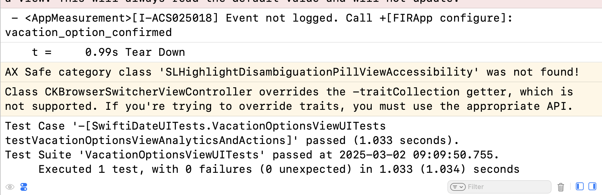

---

### ZodiacPickerView 測試結果

我們針對 ZodiacPickerView 進行了 UI 互動測試，主要檢查以下幾點：

- 頁面曝光：當畫面出現時，上報「zodiac_picker_view_appear」事件，確保進入星座選擇頁面時能進行正確的曝光統計。
- 選擇星座：當用戶點擊任意星座（例如「巨蟹座」）時，綁定值能夠正確更新為所選星座，並透過 Analytics 上報「zodiac_selected」事件，附帶正確的星座參數（如 “巨蟹座”）。
- 清空操作：當用戶點擊「清空」按鈕後，星座綁定值會被清空（設為空字串或其他預設），同時上報「zodiac_cleared」事件。
- 確認操作：當用戶點擊「確定」按鈕時，會上報「zodiac_picker_confirm」事件，並關閉當前頁面。

透過上述流程，可確保 ZodiacPickerView 與後端 Analytics 事件能夠正確連動，並確保使用者選擇或取消選擇星座時，綁定值及事件上報都能如預期執行。所有測試均已成功通過，確保我們的 ZodiacPickerView 在用戶互動時能夠正確更新綁定值並上報分析數據。

### 測試通過截圖：
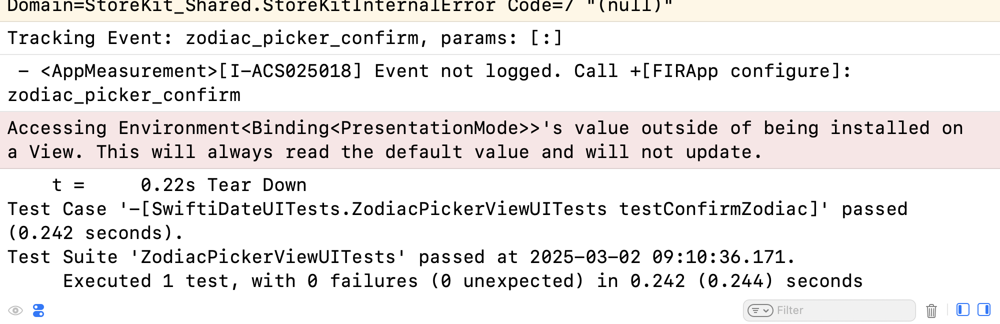
